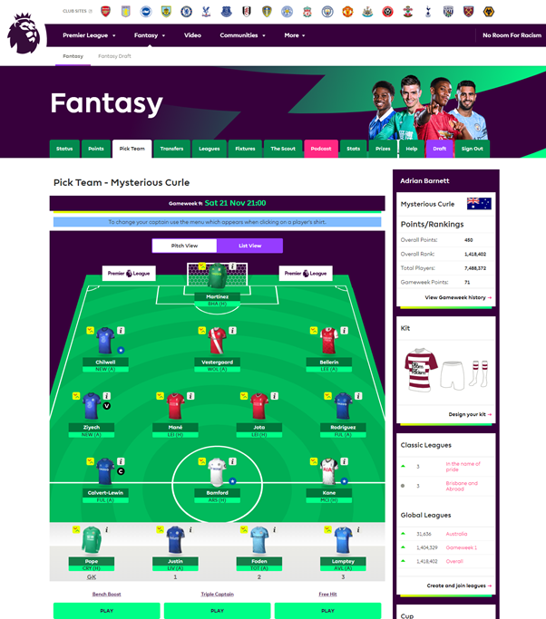
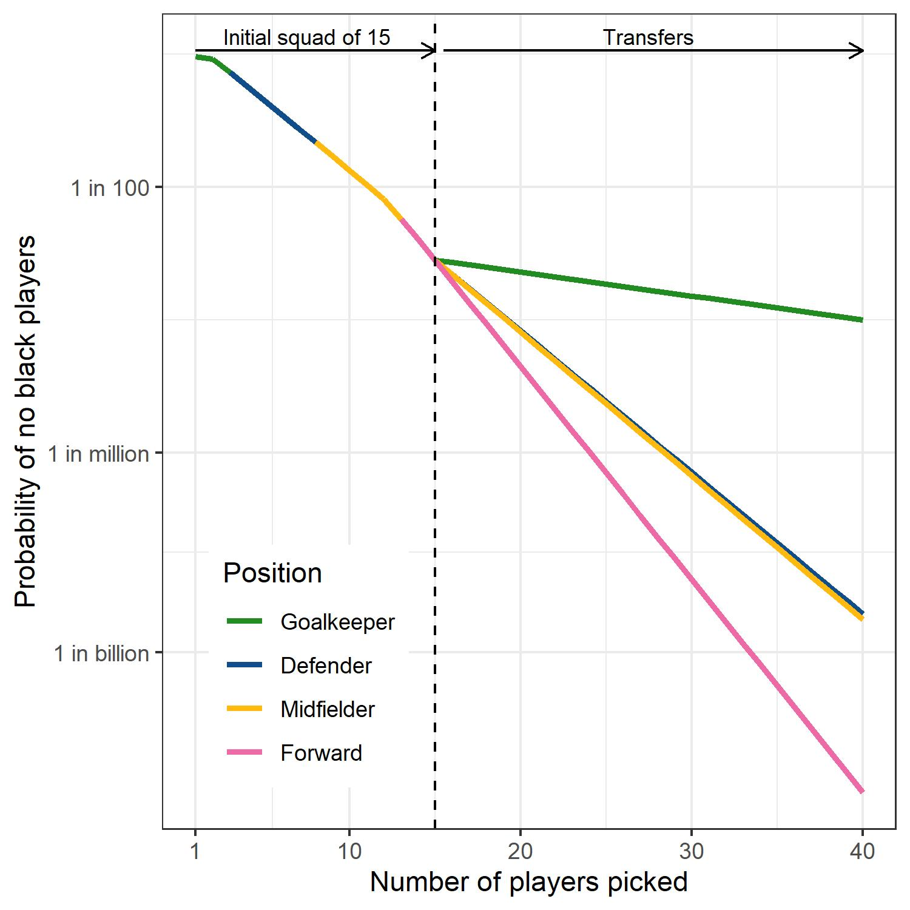

In 1998, the French men’s team won the football World Cup for the first time in their history. For most of the country, even non-football fans, it was a joyous moment and the trigger for a massive national party, especially as the tournament was in France with the final in Paris.

```{r, include=FALSE}
knitr::opts_chunk$set(dpi=400, echo=FALSE, warning=FALSE, message=FALSE)
```

At least one Frenchman did not join the party: the rancorous politician Jean Marie Le Pen, who complained that the team was not “French enough”, a cowardly reference to the number of black players in the team. Le Pen was already renowned for making racist statements, and ran – and lost – five times as a far-right candidate for the French presidency. 

I often remember Le Pen’s ridiculous complaint. France’s black players were some of the best in the tournament and France might well not have been world champions without them. 

Football has come a long way in tackling racism in the last two decades, but racism in football is not yet eradicated. There have been recent racist chants in matches across Europe, and high-profile black players have been poorly treated by some parts the mainstream media and suffered racist slurs on social media [@Steinberg2019].

Considering racism in football today, I wondered if there were similar problems in a popular online football game where users pick a team of players from the English Premier League and win points when their players do well. Could I find users who picked teams with no black players?

The [Official Fantasy Premier league](https://fantasy.premierleague.com) has over 7&nbsp;million teams and is played around the world. It is discussed in an abundance of blogs and podcasts, including a regular BBC radio show to discuss tactics and tips. 

In a clear sign that racism is a problem amongst some users, last season’s league leader was disqualified after they made racist remarks about Raheem Sterling, a high-profile black player [@DUrso2020]. The eventual winner was an Oxford university mathematician.

Each user picks 15 players with a budget of £100 million. The best players cost more, so you can’t just fill your team with the most renowned players. Nor can users just select, say, the entire Liverpool&nbsp;FC team: only 3 players from the same team are allowed. Users make initial picks to fill a squad of 15 with 2&nbsp;goalkeepers, 5&nbsp;defenders, 5&nbsp;midfielders and 3&nbsp;forwards (see Figure&nbsp;1). As the season progresses, users can transfer players in and out, depending on their budget. Transfers are limited to 1&nbsp;free transfer per game week, with additional transfers costing points. Users can choose to make unlimited transfers in two weeks of the season by playing a wildcard.

{width=90%, height=90%}

#### Figure 1: Example fantasy football team. There are 15 players in total, 11 on the pitch and 4 on the bench. Note the “No room for racism” link in the top-right.

The Fantasy Premier League make their data openly available. I downloaded over 128&nbsp;million player selections from around 5&nbsp;million users for the first five weeks of the 2020/21 season. I didn’t get all the data due to time constraints; getting these millions of records took two weeks. 

I downloaded the data on the 588&nbsp;footballers in the premier league and categorised each player as readily identifiable by others as black or not; two friends checked my categorisation. A binary classification of race is simplistic and some players may have a more complex identity. However, I was hoping to find the bad behaviour of people making simplistic choices and believed this binary classification would be adequate for this goal.

There are many black players in the Premier League, with more who play as strikers than goalkeepers (see Table&nbsp;1). 

```{r, echo=FALSE, comment=''}
library(dplyr)
library(flextable)
data = read.table(header=FALSE, sep='&', text='
Goalkeeper (2)&65&5&0.08
Defender (5)&214&81&0.38
Midfielder (5)&237&91&0.38
Striker (3)&72&36&0.50
Total (15)&588&213&0.36') 
names(data) = c('Position (number per team)','Total number of players','Number of black players','Proportion of black players')
tab = flextable(data) %>%
  theme_box() %>%
  autofit()
tab
```

#### Table 1: Proportion of black players in the English Premier League fantasy game by position. These are based on my own categorisation and there is no official league data on player ethnicity.

I calculated the probability of a user picking no black players simply by chance. Starting with the two goalkeepers, the probability the first goalkeeper will not be black is 60/65 (0.92). For the second goalkeeper we assume the first pick was not a black player, so the probability the second goalkeeper will not be black is reduced slightly to 59/64 (0.92). To get the probability of no black goalkeepers by chance alone we multiply the two probabilities and get 0.84. 

The probability that the first defender picked will not be black is 133/214 (0.62) and the first striker is 36/72 (0.50). After filling a team with 15 players, the probability of a user picking no black players by chance is just 0.00079, less than one in a thousand. This small probability arises from the steady reduction of the cumulative probability for each player picked. 

Once the matches start, users can transfer players in any position, hence the probability after 15&nbsp;picks varies by position. The probabilities for transfers in each of the four positions are shown in Figure&nbsp;2. After 40&nbsp;picks, the probability of picking no black players by chance is very small, particularly for users changing their strikers where is it smaller than 1 in a billion. 

{width=60% height=60%}

#### Figure 2: Probability of a user picking no black players depending on the number of transfers. The y-axis is on a log scale (base&nbsp;10). The dotted vertical line is at the first 15 picks, where all users must have picked 2&nbsp;goalkeepers, 5&nbsp;defenders, 5&nbsp;midfielders and 3&nbsp;forwards.

Focusing on the observed data, I looked at users with no black players and 30 or more transfers. I found just 11 with no black players from 5.3&nbsp;million users. The expected number of number of users assuming no racist behaviour is around 12, hence the numbers show no issue. 

The names suggested otherwise. Three of the team names were: “whites & latinos only”, “white lives matter” and “f**k antifa”. There were clearly some racist users.

I contacted the Fantasy Premier League about the player with the team name of “whites & latinos only” pointing out their racist name and team picks. The league’s terms and conditions state: “The Premier League reserves the right to suspend and delete Registrations that contain team or league names which are deemed by the Premier League to be inappropriate or offensive.” An automated message said I would get a response in two days.

After getting no reply from the league after a week, I contacted journalists at [The Athletic](https://theathletic.com/uk), a sports website with investigative journalists. The journalists (Joey D’Urso and Carl Anka) suggested searching for users with other offensive names, regardless of their player picks.

I searched 7&nbsp;million user team names for a range of slurs, including terms used to vilify women, race, sexual orientation, and disability. I also included renowned sex offenders and murderers. For every phrase I tried, I found at least one distasteful example, often hundreds of them. Some of the names were sickening, well beyond repeating here, including those celebrating murder, paedophilia and the holocaust.

The Athletic contacted the league about the names and wrote two stories about the disturbing amount of vile we found [@DUrso2020;@Anka2020]. The day The Athletic contacted the league, and 16 days after I contacted them, I got a response. They agreed that “whites & latinos only” was an offensive name and removed the name and warned the user. But on the issue of teams with no black players they said: “It’s up to each manager to decide which players to select and transfer. There is no requirement in the Terms to have a racially diverse squad. Therefore there is no action we can take in this instance.” 

With over 7&nbsp;million users, there could be a small number of teams with no black players purely by chance, but the probabilities become ever smaller as the number of transfers grows. There are users in the league who have made 50 picks without a single black player, giving them a very small probability of this happening by chance of around 1 in a billion. After a user has made 57 picks (ignoring goalkeepers) the probability of picking no black players by chance is less than 1 in a trillion. At what threshold should the league take action?

Looking at the numbers has been worthwhile, because it spurred the investigations that found thousands of offensive names. In hindsight, I could have just searched the users’ team names, but I had assumed that such overt racism in words would be automatically filtered by the league, and instead I was looking for covert racism in numbers. 

The league’s systems for checking names could be improved, and names could be checked before being published. Currently users can write whatever they like in their team name and this may get censored after being detected. 

Many users are trying to avoid automated language checks as their slurs were written without spaces or replacing numbers for words (such as ‘1’ for ‘i’). However, thousands of users brazenly published offensive and libellous team names.

Automated detection systems will never be perfect. To harness the power of people the league recently added a button on every user’s page that allows offensive names to be easily reported. 

The league does expunge team names and expel repeat offenders, and names are changed to “CHANGE NAME” for users given a second chance or “deleted user” for users kicked off the game. I searched seven million team names and found over 8,000 (0.1%) with a team name of “CHANGE NAME” and over 9,000 (0.1%) deleted users. So whilst the percentage of users with offensive names is small, it is a sizeable problem involving thousands of users. 

In 1993, I watched England play a World Cup qualifier against the Netherlands, with a huge crowd of over 73,000 people. One of England’s best players was the high-profile black player John Barnes. When his name was read out before the game, sections of England fans loudly booed. Barnes provided his own answer by scoring within a minute.

Racism is still an issue for black football players, as shown by the recent booing of England players taking a knee before kick-off. There is also a great deal of hate in online football. Tackling this hate requires education and better systems to look at patterns of behaviour and language. Football can be a beautiful game and a powerful example of equality, but the playing field remains uneven and has some very dark corners. 

### References
