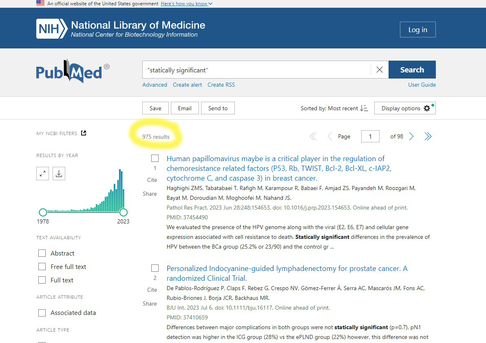

```{r, include=FALSE}
not_run = function(){ # takes too long
library(rentrez)
library(ggplot2)
library(dplyr)
ids = entrez_search(db='pubmed', term='"statically significant"', retmax=1000)
all_records = NULL
N = ids$count
for (k in 242:N){ # to avoid 414 error with requesting too many records
  record = entrez_fetch(db="pubmed", id = ids$ids[k], rettype="xml") # get from pubmed
  parsed = parse_pubmed_xml(record)
  if(length(parsed)==0){next} # for empty records like books
  # make data frame, year is sometimes empty
  year = ifelse(length(parsed$year)==0, NA, parsed$year)
  #
  frame = data.frame(pmid = parsed$pmid, # make into a data frame
             year = year, # just year
             journal = parsed$journal,
             n.authors = length(parsed$authors), # number of authors
             title = parsed$title,
             abstract = paste(parsed$abstract, collapse=' ')) # paste together paragraphs
  all_records = bind_rows(all_records, frame)
  Sys.sleep(7)
}
}
```

A colleague sent me a draft manuscript with the typo "statically significant". A typo that passes a spell check, but would surely not pass reviewers and editors?

Oh dear, a quick search of _PubMed_ reveals that it has snuck past reviewers and editors, many many times. There are 975 abstracts that have used this nonsense phrase. We should have a celebration for the 1000th paper!



Surely that's only in the terrible journals though? Well only if you consider JAMA to be  terrible (abstract [here](https://pubmed.ncbi.nlm.nih.gov/36472594/)).

It has also happened in [BMJ Open](https://pubmed.ncbi.nlm.nih.gov/35725252/), [BMC Surgery](https://pubmed.ncbi.nlm.nih.gov/37173653), and --- of all places --- [Reading and Writing](https://pubmed.ncbi.nlm.nih.gov/35530430), which "publishes high-quality scientific articles pertaining to the processes, acquisition, and loss of reading and writing skills" and is also contributing to that loss.

"statically" is a good word, it often gets paired with "charged". Like statically charged hair from a Van de Graaff Generator.

"statistically" is a good word, it often gets paired with "significant" to the detriment of both. 

I didn't think that the use of "statistical significance" could get any worse, but I was wrong. It's an immovable trope that's become so lazily used that you can throw it down using free-form spelling and still get published. 

All this recent worry about what semi-intelligent machines might write. I'm remain deeply concerned about the writings of actual people. 
